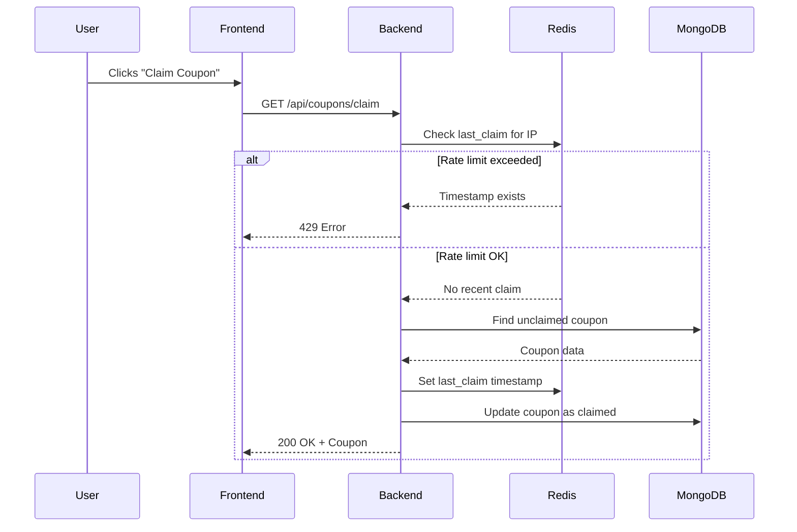

# FairShare - Coupon Sharing Platform 🎟️

A scalable coupon-sharing platform that ensures **fair usage** and **real-time tracking** using Redis for rate limiting and cookies for seamless user experience.

---

## 🔗 Live Demo
**[https://fairshare-frontend.vercel.app](https://fairshare-frontend.vercel.app)**

---

## 🔗 Live Video Demo
**[https://drive.google.com/file/d/1hkiQ3hCnA23YucVmFnIH3FmAhCeap2fG/view?usp=drive_link](https://drive.google.com/file/d/1hkiQ3hCnA23YucVmFnIH3FmAhCeap2fG/view?usp=drive_link)**

---

## 📂 Project Structure
backend/
├── config/
│ └── db.js # MongoDB connection setup
├── controllers/
│ └── couponController.js # Business logic for coupon operations
├── models/
│ └── Coupon.js # MongoDB schema for coupons
├── routes/
│ └── couponRoutes.js # API endpoint definitions
├── redis/
│ └── redis.js # Redis client configuration
├── server.js # Entry point for the backend

---

## 🛠️ API Routes
All endpoints are prefixed with `/api/coupons`.

| **Method** | **Endpoint**   | **Description**                          | **Request Body** | **Response**                     |
|------------|----------------|------------------------------------------|------------------|-----------------------------------|
| `GET`      | `/claim`       | Claim a coupon (rate-limited)            | None             | `{ coupon: { code, expiresAt } }`|
| `GET`      | `/list`        | Get all unclaimed coupons (Admin-only)   | None             | `[ { coupon1 }, { coupon2 } ]`   |
| `POST`     | `/create`      | Create a new coupon (Admin-only)         | `{ code }`       | `{ message: "Coupon created" }`  |

---

## 🎮 Controllers
### **`couponController.js`**
Handles the core logic for coupon operations.

#### `claimCoupon(req, res)`
- **Purpose**: Allow users to claim a coupon while enforcing rate limits.
- **Workflow**:
  1. Extract the user’s IP from `request-ip`.
  2. Check Redis for the last claim timestamp using the IP as the key.
  3. If the user has claimed a coupon within 1 hour:
     - Return `429 Too Many Requests`.
  4. If eligible:
     - Fetch the oldest unclaimed coupon from MongoDB.
     - Mark it as claimed and save to DB.
     - Update Redis and set a cookie with `last_claim` timestamp.
     - Return the coupon details.

#### `listCoupons(req, res)` (Admin-only)
- **Purpose**: Fetch all unclaimed coupons (requires admin privileges).
- **Workflow**:
  1. Verify admin access via JWT middleware.
  2. Query MongoDB for coupons where `isClaimed: false`.
  3. Return the list of coupons.

#### `createCoupon(req, res)` (Admin-only)
- **Purpose**: Create a new coupon (requires admin privileges).
- **Workflow**:
  1. Verify admin access via JWT middleware.
  2. Extract `code` from the request body.
  3. Save the new coupon to MongoDB.
  4. Return a success message.

---

## 🔄 Workflow Diagram

Installation
    git clone https://github.com/Theyaseenahmad/fairshare-frontend.git
    cd fairshare-frontend
    npm install
    npm run dev

    Frontend
bash
Copy
git clone https://github.com/Theyaseenahmad/fairshare-frontend.git
cd fairshare-frontend
npm install
npm run dev

Backend
bash
Copy
git clone https://github.com/Theyaseenahmad/fairshare-backend.git
cd fairshare-backend
npm install
npm start